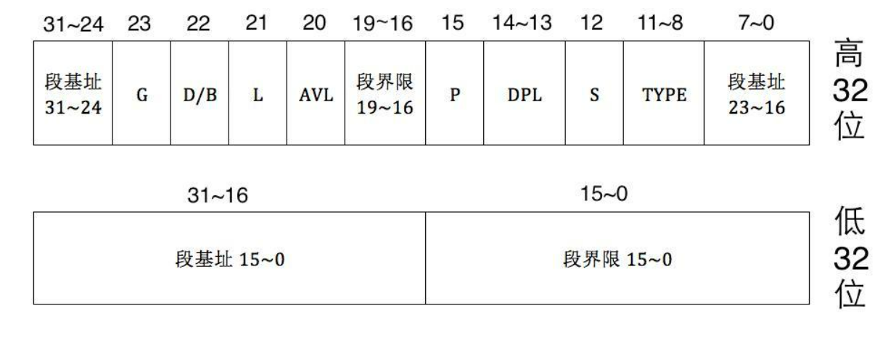
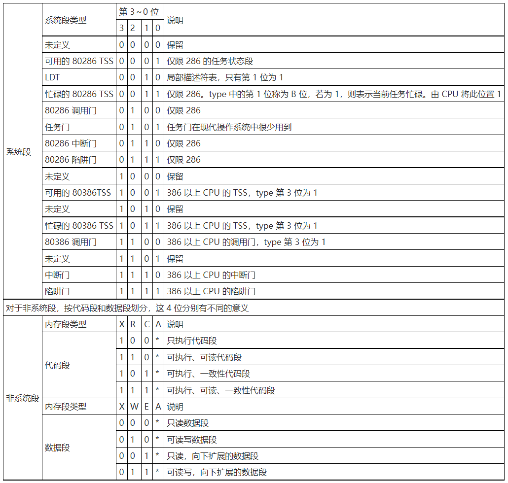

# 段描述符 & 段描述符表
段描述符是用来描述内存段的，我们把内存分为不同的的段，用来实现不同的功能，这样比较安全。每一段用一个段描述符，8 Byte, 64 bits.

有段描述符，就有一个段描述符表，比如我们要访问数据段，那就去这个段描述符表中，找对应的段描述符信息。

下面就分别说明段描述符和GDT（全局描述符表）。

为了方便查看，这里面给先把总表给出来：

## 段描述符
### 段基址和段界限

要描述一段内存，首先得限定它的头和偏移，段描述符用**段基址**表示头，**段界限**表示偏移，一般正常使用内存都是从低到高，但是栈是从高到低更方便。所以就有两种方式，一种是向高地址偏移，一种是向低地址偏移，所以必有一位用来描述是向上扩展的还是向下扩展的，这个在功能上属于内存的使用方式，因此放到后面说。

- 段基址：

    保护模式的内存地址宽度为32位，所以段基址需要占用段描述符中的32位。段基址他们在描述符的存放位置如下：

    | 比特位        | 功能标记       | 功能说明                              |
    |:----------:|:----------:|:---------------------------------:|
    | 63-56（8位）  | 段基址（31-24） | 段基址的高8位（最高字节），存放位置是段描述符的第7字节（高32位的31-24位）     |
    | 39-32（8位）  | 段基址（23-16） | 段基址的次高8位（第2字节），存放位置是段描述符的第4字节（高32位的7-0位）     |
    | 31-16（16位） | 段基址（15-0）  | 段基址的低16位（第1，0字节），存放位置是段描述符的第3，2字节（低32位的31-16位）|

    可以看出，并不是连续存放的，有3个字节在一起，但是之所以分开写是因为一段位于高32位，一段位于低32位。之所以不连续是考虑到兼容性地问题。

- 段界限：

    段界限就不是32位了，原因也很简单，一共就8字节，64位，段界限要是32位的话其他的信息就没法存放了，描述了个寂寞。

    所以段界限设定为了20位，20位是1MB，那么这个段未免有点太小了，所以又额外设置了一位**G位**(位于第55位，高32位的23位），用来描述段界限的每一位代表的偏移量，`G=0`为1字节，`G=1`表示4KB，用16进制则是0x1000。那20位的段界限最大表示偏移量是0x100000000，即1个1，32个0（bit)，4GB。

    段界限在段描述符的表的存放规则如下：

    | 比特位        | 功能标记       | 功能说明    |
    |:----------:|:----------:|:-------:|
    | 51-48（4位）  | 段界限（19-16） | 段界限高4位  （存放位置是段描述符高32位的19-16位）|
    | 15-00（16位） | 段界限（15-00） | 段界限低16位 （存放位置时段描述符低32位的15-0位） |

段基址和段界限分别是32位和20位，共52位，那么对于64位的段描述符，低32位已经被占满了，高32位还有12位用来描述这个段的特征，分别是高32位的23-20位，以及15-8位一个字节。其中高32位的23位已经被G位占用，是用来描述段界限的偏移单位的。

### 段的分类
段大致分为两大类，一类是系统段，另一类是非系统段，其中就包括代码段，数据段，栈段，显存段等。共需要段描述符高32位的12-8位来描述。12位成为S位，用来描述系统段/非系统段，剩下4位是type，用来描述具体的特征。

栈段，数据段，代码段我们都让他们访问整个32位地址可以描述的4GB内存，这样更为灵活，同样我们也采用平坦模式即段基址为`0x00000000`（8个0），段界限为`0xFFFFF`，同时需要把23位的G位置为1。

显存段在实模式的1MB空间中分配到的空间如下：

| 功能 | 地址|
|:---:|:---:|
|彩色显示内存|`0xA0000-0xAFFFF`|
|黑白显示内存|`0xB0000-0xB7FFF`|
|文本显示内存|`0xB8FFF-0xBFFFF`|
|显示BIOS|`0xC0000-0xC7FFF`|

我们这里主要用到的是文本模式，所以需要把`0xB8FFF-0xBFFFF`设成段，那么段基址很容易知道是`0x000B8FFF`，段界限我们还是把G设成1，也就是4KB，那么0xFFFF-0x8FFF=0x7000（共7*4KB，28KB), 0x7000/0x1000 = 7，那么段界限就是`0x00007`。

- 系统段：

    主要涉及到中断门，陷阱门等，这个不是本篇描述的重点。那么用来区别是系统段还是非系统段则需要1位。这一位是S位，位于高32位的12位，S位为0表示系统段，为1表示非系统段。区别中断门，陷阱门等需要4位，分别是段描述符高32位的11-8位。

- 代码段：

    存的都是运行的指令，需要把内存设置为可执行的（1位），是否可读（1位），是否是一致性代码（1位）。一致性代码是系统用来限制低特权访问的，详细的可以参考[一致性代码段](https://www.cnblogs.com/geason/p/5774088.html)。

- 数据段：

    存放的都是数据，需要把内存设置为不可执行的（1位），是否可写（1位），段的扩展方向（1位）。

- 栈段：

    再说数据段时说到有一位是用来描述段的扩展方向的，这里栈段和数据段合用，也就是把栈段设置为向上扩展的。

详细说明参考下表：

### Access Byte
顾名思义，这是一个字节，在高32位的Base后面，也就是40-47位, 除了上面提到的那5位type，还有这个字节的第七位P位，和5，6位的DPL。整个这个字节都是为了设定这个描述符的连接状态的。

- P位

    Present，这位用来指示段是否存在于内存中，如果为1，则在内存中，反之则不在。如果内存不足，CPU会把段描述符中的某一段换到硬盘，需要的时候再加载进来，所以有这么一个位数。在没有分页之前，这个是很有用的。分页后就换出一个页就可以了。

- DPL位
    Descriptor Privilege Level, 描述符特权级，一共四个特权级，这个是和CPL，RPL一起使用的，只有CPL和RPL和当前特权DPL值满足要求才能访问，具体可以看[linux-0.11进程启动代码笔记](https://www.cnblogs.com/shuijiaoa/p/15989866.html)
###  G位，D/B位，L位，AVL位

从段基址和段界限的段描述符比特位占用就可以看出，段基址的高32位中的23-20位（共4位）仍然是空的。这4位就分别被G位，D/B位，L位，AVL位占据。这四位称为Flags位。

- G（Granularity）位

    这个我们在描述段界限的时候提到过，用来设置段界限的单位, 位于高32位的23位。

- D/B位

    这个位位于高32位的22位，主要是为了向下兼容考虑，我们当前讨论的是32位保护模式的情况，那么自然要为之前16位的保护模式来考虑。

    32位和16位主要影响的就是操作数，以及指令的有效地址，也就是ip，sp, eip, esp，0为16位，1位32位。

- L位
  
    设定代码段的是否为64位，我们当前讨论的是32位系统，那么这位设为0就可以，位于高32位的21位。

- AVL位

    Available位，这位当前没有什么特殊的用途，维基上也写的是Reserved，位于高32位的20位。

